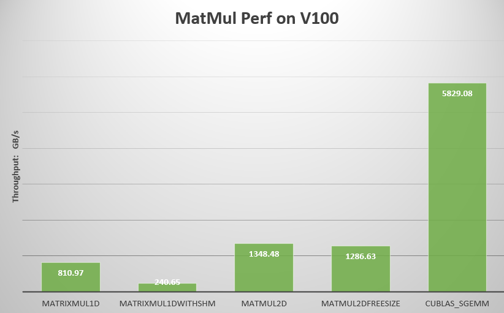
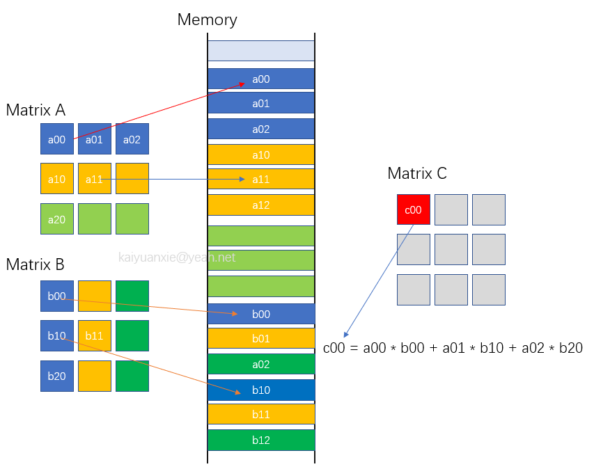
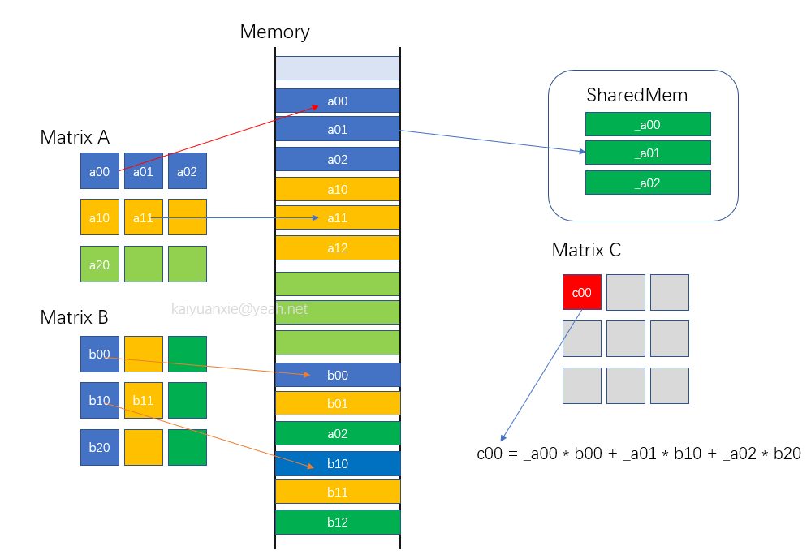
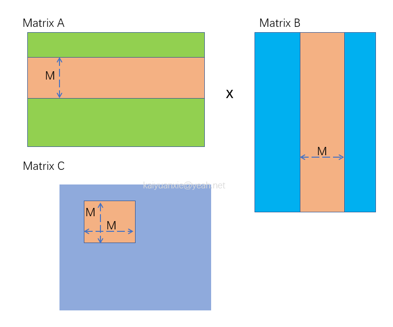
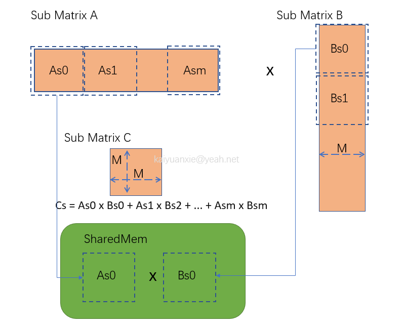
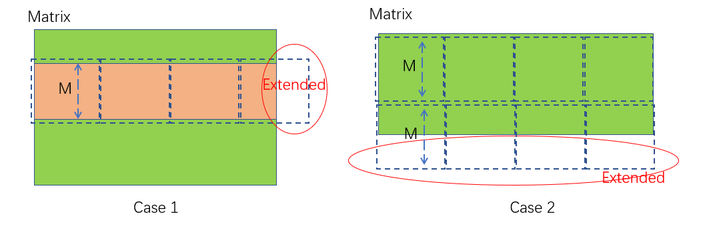

# MatMul - Matrix Multiplication
## Description
This sample implements matrix multiplication: C = A * B.  It has different versions of realization, which makes you understand the process step by step. Also, you can easy to get the throughput of these methods by running the code. There is a result of test on V100 as follow:

```
./matMul wA=1024 hA=256 wB=128 hB=1024
```
<div align=center>  <div align=left>

## Build and Run
```
$ cd <dir>
$ make
```
For different SMS, set parameter SMS. 

*   **SMS="A B ..."** - override the SM architectures for which the sample will be built, where `"A B ..."` is a space-delimited list of SM architectures. For example, to generate SASS for SM 50 and SM 60, use `SMS="50 60"`. A100 set SMS=80
```
$ make SMS="80"
```

Run the matMul:

Get help information:
```
$ ./matMul help
Usage -device=n (n >= 0 for deviceID)
      -wA=WidthA -hA=HeightA (Width x Height of Matrix A)
      -wB=WidthB -hB=HeightB (Width x Height of Matrix B)
      -iter=n Iteration numbers of algorithm. Default:500
      -algo=[0|1|2|3|4|5] 0: Test all, 1: MatMul_1D_KERENL, 2:MatMul_1D_KERNEL_WITH_SHARED_MEMORY, 3: MatMul_2D_KERENEL_BLOCK_MULTIPLES_SIZE, 4: MatMul_2D_KERNEL_ANY_SIZE 
      5: MatMul_CUBLAS_SGEMM_KERNEL
Note: Outer matrix dimensions of A & B matrices must be equal.

```

Given the width and height of matrix with a specific algorithm e.g. 
```
$ ./matMul wA=1000 hA=312 wB=11 hB=1000 algo=4

[Matrix Multiply Test] - Starting...

NOTE: The CUDA Samples are not meant for performance measurements. Results may vary when GPU Boost is enabled.
MatrixA(1000,312), MatrixB(11,1000)
Computing result using MatMul2DTest Kernel.
Spport any size, e.g. wA=1000 hA=312 wB=11 hB=1000.
Warmup  operation done
Performance= 111.46 GFlop/s, Time= 0.062 msec, Size= 6864000 Ops, WorkgroupSize= 1024 threads/block
Checking computed result for correctness: Result = PASS
```

## A matrix multiply in CPU
We often use x,y to describe indices of 2D Matrix, 
however its data allocated on memory is in linear form.
We use a data pointer to represent first location on memory. 
And convert 2D index to 1D to get the number in matrix.
Thus, matrix multiply can be realized as follow, which is a type of C = A x B operation on CPU. 

<div align=center>  <div align=left>


```c++
/*
* float *C, *A , *B: data pointer of matrix C, A, B each.
* unsigned int wA: width of A.
* unsigned int wC: width of C, which equals height of B.
* unsigned int hC: hegith of C, which equals height of A.
*/
void matrixMulCPU(float *C, const float *A, const float *B, unsigned int wA,
                  unsigned int wC, unsigned int hC) {
  unsigned int hA = hC;
  unsigned int wB = wC;
  for (unsigned int i = 0; i < hA; ++i)
    for (unsigned int j = 0; j < wB; ++j) {
      double sum = 0;
      for (unsigned int k = 0; k < wA; ++k) {
        sum += (double)A[i * wA + k] * (double)B[k * wB + j];
      }
      C[i * wB + j] = (float)sum;
    }
}
```
The snippet shows a simple way to realize the process. It has three loops that calculate the
elements one by one.  The iterations/times of loops is hA * wB * wA. If each step costs
deltaT time and single thread is used, the total time equals: 
    
    hA * wB * wA * deltaT 
Of course there are many optimizing methods to accelerate this process on CPU.
But we turn focus on GPU, the most important idea of GPU is that has huge number of threads to 
deal with dense calculation scenarios. In this case, we can invoke parallel threads to
compute the "sum += (double)A[i * wA + k] * (double)B[k * wB + j];". So the total time 
cloud be theoretically reduced to:

    hA * wB * wA * deltaT / N
    
N: Depends on number of threads.  

## 1D Block Kernel

Each thread deal with data of one row  from A and one column from B to get an element of C.
e.g. Assumption the number of threads equals C size. Then thread[i][j] will finish the follow
process:

C[i][j] = Sum(A[i][k] * B[k][j]),  k = 1,2,3,4,...wA;

In fact, the threads number does not all ways equal to the element size of C,
which could less than or more than it. Thus, we need a loop to make sure when threadNum < 
sizeC, the threads group could compute all data. On the other hand, while threadNum > 
sizeC, need to avoid illegal memory access. The common method:
    
    while (threadIdx < sizeC) { }
    
The code snippet as follow锛?
```cu
__global__ void MatMulKernel1D(float *C, float *A, float *B, const int wh, const int wC, const int hC)
{
    const int totalSize = wC * hC;
    int thID = threadIdx.x + blockIdx.x * blockDim.x;
    while (thID < totalSize) {
        int Cx = thID / wC;
        int Cy = thID % wC;
        float rst = 0.0;
        for (int i = 0; i < wh; i++) {
            rst += A[Cx * wh + i] * B[i * wC + Cy];
        }
        C[Cx * wC + Cy] = rst;
        thID += gridDim.x * blockDim.x;
    }
}
```

## 1D Block Kernel with Shared Memory
The previous method can be optimized by using shared memory. The data from global memory
 to register needs to via L1/L2 and the speed of read/write rate is lower than shared memory. While the 
 data are accessed frequently, it is better to transfer them on shared memory.
In this case, the elements of matrix need be read several times. E.g. if A (width:M height: N)
, B (width:K height: M), in order to get a row (e.g. i) of C. The i row of A would be accessed K times.

<div align=center>  <div align=left>

Theoretically, we turn i row data trans form:

    (Global memory -> L2 -> L1 -> register) * K  * factor1

To:

    Global memory -> shared memory + (shared memory -> register) * K * factor2

The code snippet:

```c++
template <int shWASize>
__global__ void MatMulKernel1DWithShMem(float *C, float *A, float *B, const int wA, const int wC, const int hC)
{
    __shared__ float sRow[shWASize]; // shared wA
    int blockID = blockIdx.x;
    while (blockID < hC) {
        int thIdx = threadIdx.x;
        while (thIdx < wA) {
            sRow[thIdx] = A[blockID * wA + thIdx];
            thIdx += blockDim.x;
        }
        __syncthreads();

        thIdx = threadIdx.x;
        while (thIdx < wC) { // wB = wC;
            float sum = 0.0;
            for (int i = 0; i < wA; i++) {
                sum += sRow[i] * B[wC * i + thIdx];
            }
            C[blockID * wC + thIdx] = sum;
            thIdx += blockDim.x;
        }
        blockID += gridDim.x;
    }
}
```

 '\__shared\__ float sRow[shWASize]' to reuse the data of matrix A. Each thread of block gets a element of a row of matrix A. When the number of threads might be less than the width of A,
 use "while loop" to solve:
```
while (thIdx < wA) {
    sRow[thIdx] = A[blockID * wA + thIdx];
    thIdx += blockDim.x;
}
```
Note: The max size shared memory is different in different GPU architectures.

When test ��?D Block Kernel with Shared Memory��?you will find it is slower than 
previous method (without shared memory) in most scenarios. Definitely, the cost time of 
 using shared memory is bigger than reducing time in this case. 
However, there is still has space for optimization, such as 2D block with shm.

## 2D Block Kernel with Block Multiples Size
2D Block means one can use the [x][y] like index to operate threads. Usually, the block
size m * n is smaller than the Matrix M * N. The matrix can be divided to many parts,
each part is equal to a block size, thus each block carry out a part of calculation of the result Matrix C.
Called the part result is sub-matrix, Cs. (Assumption: Cs size:M * M)
    
<div align=center>  <div align=left>

Further, Cs = As0 x Bs0 +  As1 x Bs2 + ... + Asm x Bsm. For a sub-matrix calculation, such as As0 x Bs0, use shared memory to store As0 and Bs0.
So the read times of global memory will be reduced a lot.

<div align=center>  <div align=left>

  The kernel snippet as follow:

```c++
template <int BLOCK_SIZE> __global__ void MatMulKernel2DBlockMultiplesSize(float *C, float *A, float *B, int wA, int wB)
{
    // ... omit init ...
    
    // Loop over all the sub-matrices of A and B
    // required to compute the block sub-matrix
    for (int a = aBegin, b = bBegin; a <= aEnd; a += aStep, b += bStep) {
        // Declaration of the shared memory array As used to
        // store the sub-matrix of A
        __shared__ float As[BLOCK_SIZE][BLOCK_SIZE];

        // Declaration of the shared memory array Bs used to
        // store the sub-matrix of B
        __shared__ float Bs[BLOCK_SIZE][BLOCK_SIZE];

        // Load the matrices from device memory
        // to shared memory; each thread loads
        // one element of each matrix
        As[ty][tx] = A[a + wA * ty + tx];
        Bs[ty][tx] = B[b + wB * ty + tx];

        // Synchronize to make sure the matrices are loaded
        __syncthreads();

#pragma unroll
        for (int k = 0; k < BLOCK_SIZE; ++k) {
            Csub += As[ty][k] * Bs[k][tx];
        }

        __syncthreads();
    }

    // Write the block sub-matrix to device memory;
    // each thread writes one element
    int c = wB * BLOCK_SIZE * by + BLOCK_SIZE * bx;
    C[c + wB * ty + tx] = Csub;
    
}
```

## 2D Block Kernel with Size Free

In the previous case, we neglect some cases which are the size M * N of Matrix is not 
the multiples of block size m * n. If try "./matMul wA=1000 hA=312 wB=11 hB=1000", it will get 
incorrect result. 

<div align=center>  <div align=left>


Thus, considering the size of input matrix could be any, the code has to be
modified.  In this case, 'loop' and 'if' are added in some place:

```c++
template <int BLOCK_SIZE> __global__ void MatMulKernel2DAnySize(float *C, float *A, float *B, int wA, int wC, int hC)
{
    int wB = wC;
    int maxIdxA = wA * hC;

    // Block index
    int bx = blockIdx.x;
    int by = blockIdx.y;
    // Thread index
    int tx = threadIdx.x;
    int ty = threadIdx.y;

    // In case of Grid size smaller than Matrix C, use while loop.
    while (wA * BLOCK_SIZE * by < maxIdxA) {
        // ... omit ... index init code. 

        float Csub = 0;
        int flag = 0;
        for (int a = aBegin, b = bBegin; a <= aEnd; a += aStep, b += bStep) {
            __shared__ float As[BLOCK_SIZE][BLOCK_SIZE];

            __shared__ float Bs[BLOCK_SIZE][BLOCK_SIZE];
            
            // Last part of a sub row of Matrix A/B might be samller/bigger than a block size.
            if (flag * BLOCK_SIZE + tx < wA || flag * BLOCK_SIZE + ty < hC) {
                As[ty][tx] = A[a + wA * ty + tx];
            } else {
                As[ty][tx] = 0.0;
            }

            if (flag * BLOCK_SIZE + ty < wA || flag * BLOCK_SIZE + tx < wC) {
                Bs[ty][tx] = B[b + wB * ty + tx];
            } else {
                Bs[ty][tx] = 0.0;
            }
            __syncthreads();

#pragma unroll
            for (int k = 0; k < BLOCK_SIZE; ++k) {
                Csub += As[ty][k] * Bs[k][tx];
            }
            __syncthreads();
            flag++;
        }
        
        // thread could over max.
        if (BLOCK_SIZE * bx + tx < wC && BLOCK_SIZE * by + ty < hC) {
            C[wB * BLOCK_SIZE * by + BLOCK_SIZE * bx + wB * ty + tx] = Csub;
        }
        bx += BLOCK_SIZE;
        by += BLOCK_SIZE;
    }
}

```

Then 2D block kernel could compute any size of matrix.

Certainly, there is higher performance way to execute matrix multiply, such as CUBLAS. 
It is easy to use "cublasSgemm" API to get result.  There is a test example in "./matMulCublasKernel.cu". 
The throughput of CUBLAS is usual better than one's kernel. However, it has its limitation and not always faster
whether to use it or not, depending on your scenario.


### Chinese Doc

[CUDA编程：矩阵乘运算从CPU到GPU](https://zhuanlan.zhihu.com/p/573271688)
